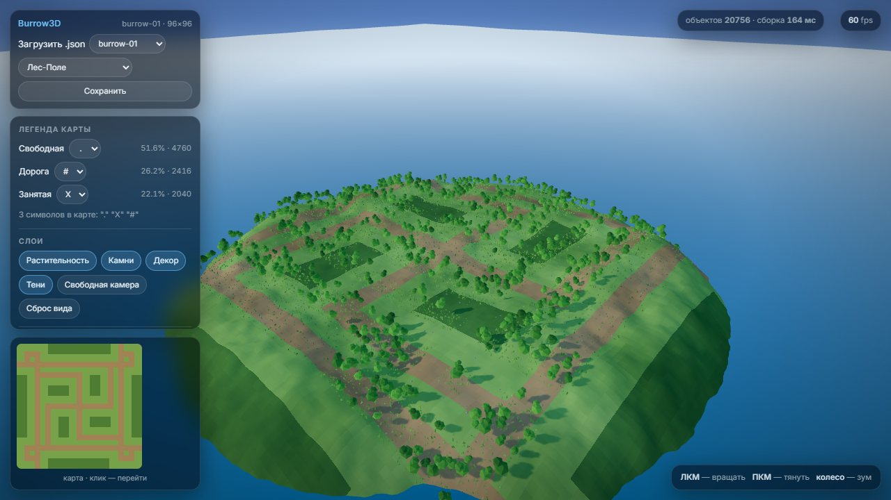
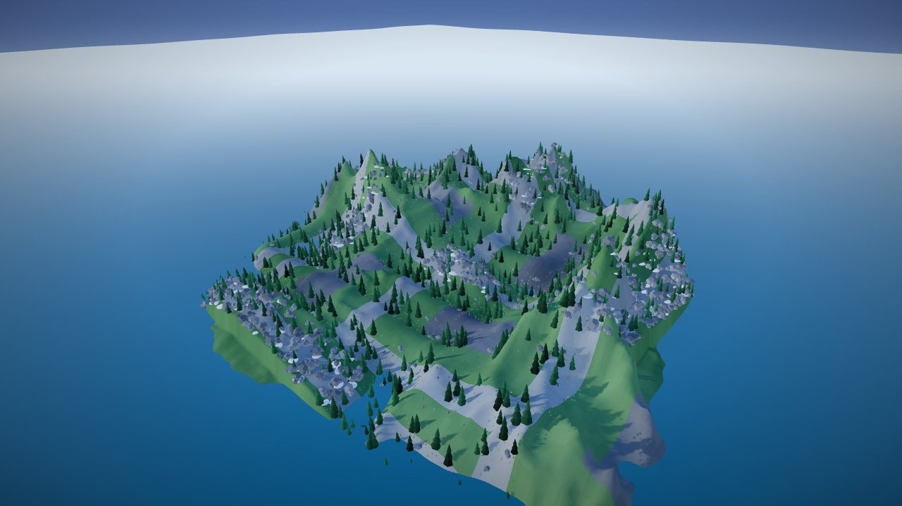
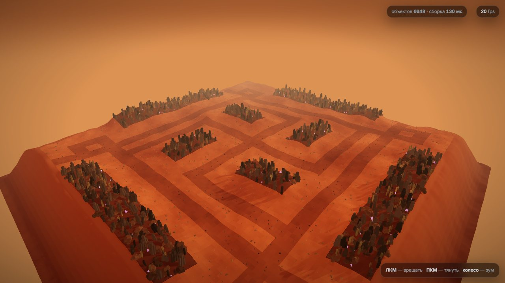
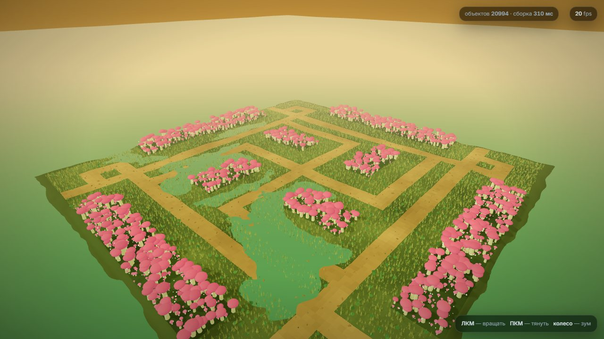
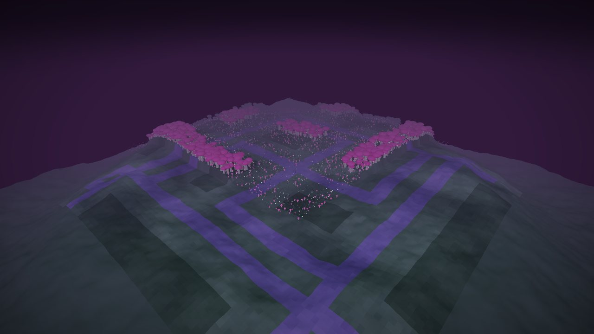
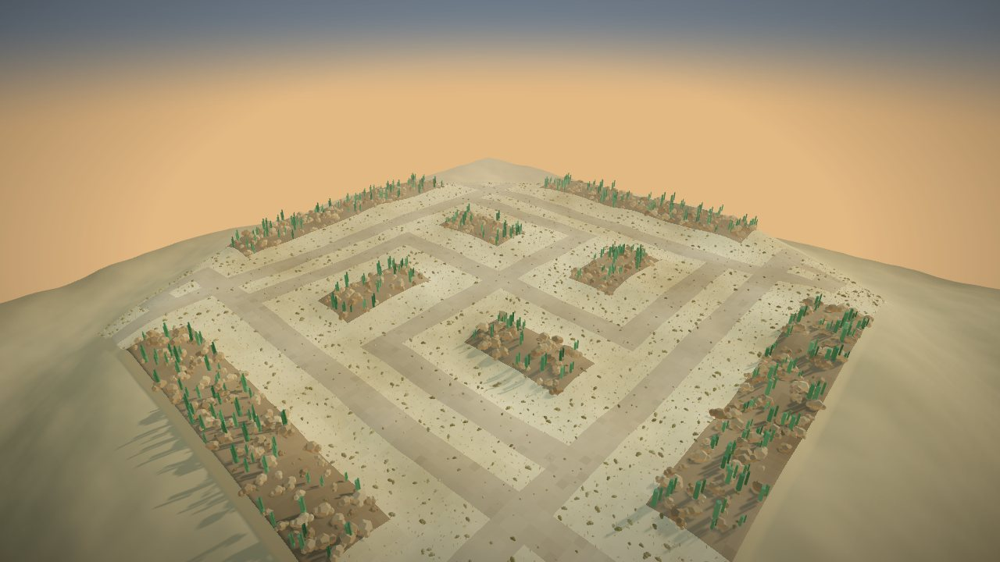
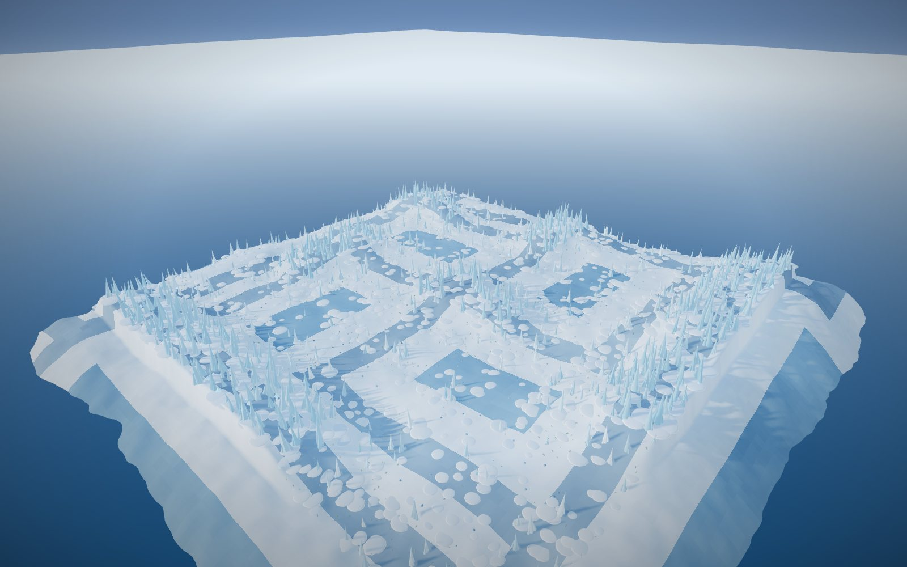
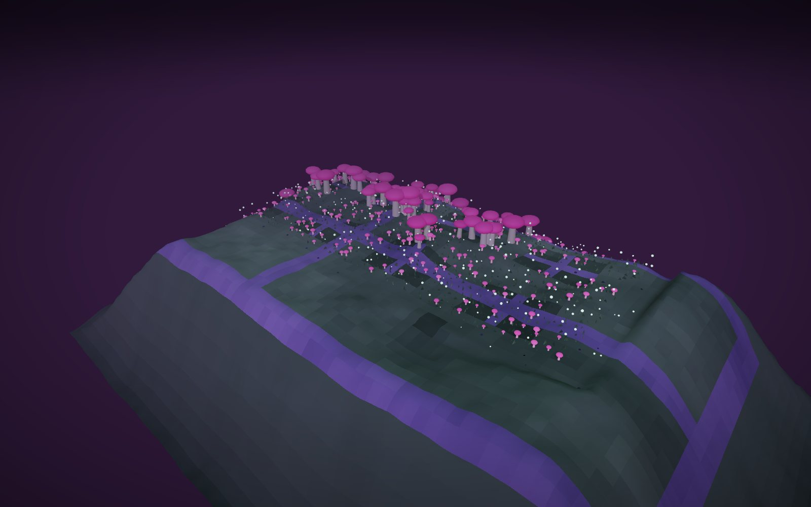
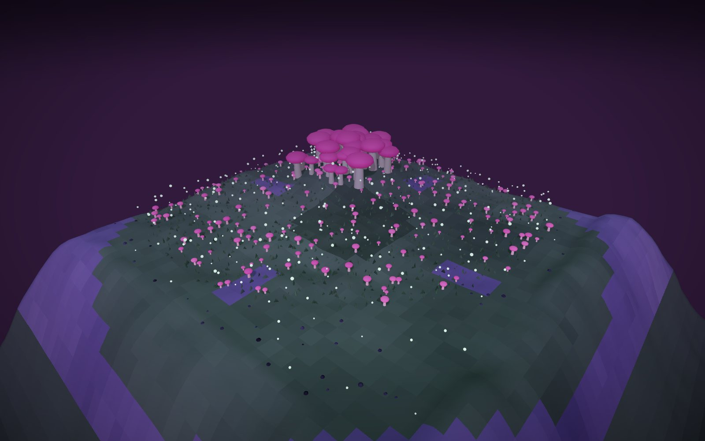

<p align="center">
  <a href="https://threejs.org/"></a>
  <a href="https://developer.mozilla.org/ru/docs/Web/API/WebGL_API"></a>
  <a href="LICENSE"></a>
  
</p>

<h1 align="center">Burrow3D</h1>
<p align="center">Превращает ASCII-карту в объёмную местность: рельеф, вода, 19 готовых объектов и 7 наборов оформления</p>

---

Карта — это JSON с сеткой символов. Движок читает её, назначает каждому символу один из трёх типов клетки (свободная / дорога / занятая) и расставляет по ней объекты: деревья, камни, кактусы, грибы, ледяные шпили. Рельеф, небо, вода и свет — всё параметризовано, размер и форма карты произвольны.

Ни сборки, ни рантайм-зависимостей: `index.html` открывается двойным кликом. Three.js подтягивается с CDN.

- **Любая карта** — свой JSON или встроенные демо; символы любые, легенда назначается в интерфейсе
- **Карты из своей папки** — кнопка «Из папки» берёт все `.json` рядом с файлом и добавляет их
  в список. Браузер не умеет перечислять каталог, поэтому выбор папки — один жест, и это
  единственный способ: `fetch` на `file://` заблокирован
- **Три типа клеток** — свободная (проходима: трава, песок, куст), дорога (везде дорога,
  по ней проходят, вид задаёт набор), занятая (непроходима: деревья, скалы, льдины).
  Препятствия физически не могут оказаться на свободной клетке или на дороге — это проверяется
- **7 наборов оформления** — Лес-Поле, Пустыня, Горы, Марсианская пустыня, Болота Венеры, Ледник, Грибная чаща
- **19 объектов** — проходимые (трава, куст, камыш, лилия, споры, галька, снежный накат)
  и непроходимые (сосны, лиственные, кактусы, валуны, базальт, грибы, ледяные шпили, кристаллы, мёртвое дерево)
- **Свободная камера** — орбита и полёт от первого лица (`WASD`, `Space`/`C`, `Shift`)
- **Слои, миникарта, сохранение карты** с приведённой легендой
- **Выгрузка кожи** — кнопка «Выгрузить кожу» отдаёт набор оформления и текущую карту
  одним JSON: цвета земли, рельеф, свет и правила расстановки. Вместо параметров шума
  в файле готовые счётчики по блокам 4×4, поэтому игре не нужно повторять шум.
  `cellSize` объявляет, во сколько раз клетка карты мельче мировой единицы, — без него
  игре неизвестен масштаб. В контракте нет перечислений ни наборов, ни объектов —
  новый набор или объект ничего в нём не ломает
- **Карта не едет по слоям** — согласованность клеток, мира и текстуры проверяется тестом
- **Рельеф по типам клеток** — горы поднимаются только на занятых клетках, дорога идёт по
  сглаженной высоте и остаётся ровной, край карты всегда выше воды и обрывается вниз.
  Это тоже проверяется тестом, а не держится на глаз

## Быстрый старт

Открыть `index.html` в браузере. Нужен интернет для загрузки three.js с CDN.

**Нужен автономный файл без интернета:**

```bash
npm install       # только @playwright/test; рантайм-зависимостей нет
npm run build     # → dist/burrow3d.html, 1.8 МБ, три.js внутри
```

`dist/burrow3d.html` — один файл: движок, наборы и демо-карты внутри, three.js лежит
как `data:`-URL в importmap. Открывается двойным кликом, сеть не нужна. Свою карту
кладёте рядом `.json` и берёте кнопкой «Из папки». `dist/` в репозиторий не попадает.

Свою карту — перетащи `.json` в окно или кнопка «Загрузить». Формат:

```json
{ "version": 1, "name": "my-map", "width": 40, "height": 28,
  "grid": ["..##..", "..##..", "......"] }
```

Смысл символов в файле не хранится — три слота легенды в панели назначаются вручную (`.` `#` `X` подставляются автоматически, если они есть в карте). Сторона карты — до 512 клеток, размер и форма произвольные.

## Выгрузка кожи

Кнопка «Выгрузить кожу» в верхней панели выкладывает набор оформления и текущую карту
одним JSON — это то, чем игра читает вид:

```jsonc
{
  "version": 1,
  "name": "desert",                          // свободная строка, не перечисление
  "cellSize": 2,                             // мировых единиц в одной клетке карты
  "map": { "width": 96, "height": 96, "fingerprint": "fa458565" },
  "ground": { "free": ["#hex", "#hex"], "road": [...], "blocked": [...] },
  "relief": { "blockedLift": 0.6, "roadFlatten": 0.85, "roadSink": 1.05 },
  "light": { "sky": { }, "water": { } },
  "scatter": {
    "cell": 4,                               // сторона блока счётчика, в клетках
    "rules": [{
      "id": "desert.tuft", "builder": "tuft",  // builder — только для чтения человеком
      "cellType": "free", "solid": false, "layer": "plants",
      "scale": [0.55, 1.25], "jitter": 1, "tilt": 0,
      "colors": { "blade": ["#hex", "#hex"] }, "glow": { }, "float": { },
      "geometry": null,                        // выгрузка геометрии — отдельная работа
      "count": [ /* ceil(w/4) × ceil(h/4) чисел: сколько объектов ждать в блоке */ ]
    }]
  }
}
```

**Счётчики вместо шума.** Игра не получает параметры шума — иначе ей пришлось бы держать
вторую реализацию и она разошлась бы с первой же правкой набора. Вместо этого в файле
готовые числа: сколько объектов правила ожидается в блоке `cell × cell` клеток.

**`cellSize` и `scatter.cell` — разные вещи.** `cellSize` — перевод клетки карты в мировые
единицы (`CELL` в инструменте равен 2). Без него игре неизвестно, во сколько раз её клетка
мельче нашей: ландшафт вышел бы вдвое ниже, а `blockedLift: 2.5` превратился бы в 1.25.
Перевод делает игра в одной точке на границе. `scatter.cell` — сторона блока, внутри
которого посчитан счётчик, и к единицам мира отношения не имеет.

**`float`** — высота парения части: у большинства объектов её нет, поэтому поле бывает
пустым объектом. **`fingerprint`** — FNV-1a на 32 бита, сверка «этот скин к этой карте»;
целостности он не гарантирует, для этого есть sha256.

**В контракте нет списков.** Ни наборов, ни объектов, ни «известных» имён: каждое правило
несёт для рисования всё само. Владелец добавит набор или десять объектов — формат,
игра и чек не потребуют правки. Полный состав `version: 1` перечислен в шапке блока
выгрузки кожи в `index.html`.

Пакетная выгрузка всех наборов разом — для проверки:

```bash
npm run export   # → dist/skins/*.json, по файлу на набор
```

Файл детерминирован: две выгрузки подряд дают побайтово одно и то же. Времени, случайных
чисел и обходов, зависящих от порядка вставки в объект, в нём нет.

## Скриншоты

<p align="center">
  
</p>

<p align="center">
  
  
</p>
<p align="center">
  
  
</p>
<p align="center">
  
  
</p>

Размер карты произвольный — 56×28 и 40×40:

<p align="center">
  
  
</p>

## Управление

| Действие | Как |
|----------|-----|
| Вращать / тянуть / зум | ЛКМ / ПКМ / колесо |
| Полёт от первого лица | `F` или кнопка, затем `WASD`, `Space`/`C`, `Shift` |
| Сменить набор оформления | выпадающий список «Набор» |
| Сменить карту | «Загрузить .json», «Из папки», перетаскивание или список демо |
| Переназначить символы | три списка в блоке «Легенда карты» |
| Перейти по миникарте | клик |
| Скрыть панель | `H` |

## Проверка

```bash
npm install       # только @playwright/test, рантайм-зависимостей нет
npm run check     # данные: карты, наборы, ссылки наборов на объекты и части
npm run build     # один самодостаточный HTML в dist/
npm test          # 11 сценариев в Chromium: сцена, наборы, карты, легенда, слои, камера,
                  # согласованность слоёв, край / дорога / горы, карты из папки,
                  # автономность собранного файла, выгрузка кожи
```

`npm run check` работает на чистом Node без установки чего-либо — правки в `biomes.js`
и `maps.js` стоит прогонять после каждой.

## Документация

- [`docs/CONTEXT.md`](docs/CONTEXT.md) — состояние проекта, открытые проблемы, журнал
- [`docs/DECISIONS.md`](docs/DECISIONS.md) — архитектурные решения
- [`docs/CHANGELOG.md`](docs/CHANGELOG.md) — история изменений
- [`AGENTS.md`](AGENTS.md) — инструкции для агентов

## Стек

| Слой | Решение |
|------|---------|
| Рендер | Three.js r169, WebGL2, ACESFilmic, PMREM-IBL |
| Геометрия | `InstancedMesh` + `mergeGeometries`, 6,6–21 тыс. объектов в зависимости от набора |
| Рельеф | value-noise fbm; ridged-мультифрактал поднимается только на занятых клетках, дорога берёт сглаженную высоту |
| Выгрузка вида | кнопка отдаёт набор и карту одним JSON; вместо шума — счётчики по блокам 4×4, `cellSize` объявляет масштаб клетки, контракт без перечислений |
| Сборка | нет — статические файлы + importmap. `npm run build` — необязательный, только для автономного файла |
| Зависимости | рантайм — только three.js с CDN (или вложенный — в собранном файле); для тестов — `@playwright/test` |

## Статус

**v0.6.0** — контракт кожи закрыт: `cellSize` объявляет масштаб клетки (без него
игра нарисовала бы ландшафт вдвое мельче), `density` переименована в `count`,
блок счётчика стал 4×4, в правило добавлена высота парения `float`,
`map.hash` стал `map.fingerprint` — это отпечаток, а не хэш целостности.
Версия осталась 1: файл пока не читает никто. Полный состав `version: 1`
перечислен в шапке блока выгрузки в `index.html`.

## Лицензия

[Apache-2.0](LICENSE) © Alexander Kuzikov
